# PocketIIDX

> iidx.pro 数据查询应用，专为 KaiOS 2.5.2 功能机（如 Nokia 2720）设计

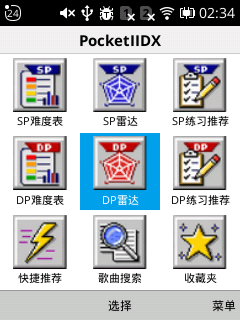

## 功能

- **SP/DP 难度表** — 温火、PPI、AAA、SP12参考、CPI、SNJ、ZRIS、ELO、ERETER、人气表
- **练习推荐** — 热手 / 进步 / 飞升 三种模式
- **六维雷达** — Notes、Peak、Scratch、Sof-Lan、Charge、Chord，支持详情与推荐切换
- **歌曲搜索** — 本地曲库缓存 + 模糊匹配，关键词搜索标题/艺术家/流派
- **歌曲详情** — 谱面信息、最佳成绩、最近成绩、难度表排名
- **本地收藏** — 跨页面收藏切换，独立收藏列表
- **状态持久** — 难度表浏览位置、视图模式自动保存

## 截图

### 难度表

| 选择难度表 | 列表视图 | 网格视图 |
|:--:|:--:|:--:|
| 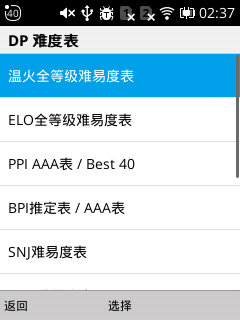 | 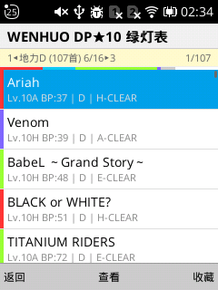 | 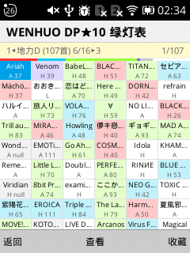 |

### 雷达与推荐

| 雷达概览 | 推荐列表（飞升） | 推荐列表（专项） |
|:--:|:--:|:--:|
| 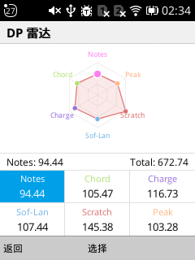 | 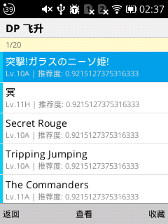 | 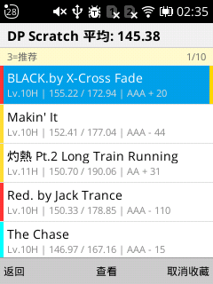 |

### 搜索与详情

| 歌曲搜索 | 歌曲详情 | 谱面切换 |
|:--:|:--:|:--:|
| 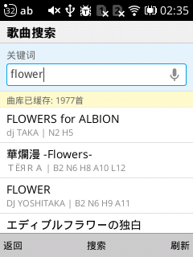 | 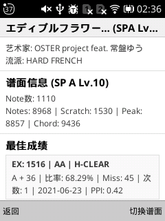 | 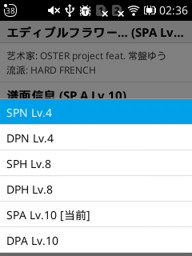 |

### 收藏

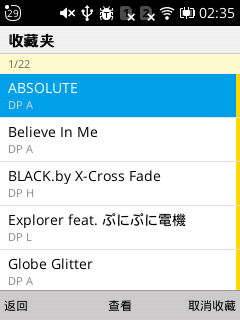

## 安装

1. 从 [Releases](../../releases) 下载 `PocketIIDX-1.0.0.zip`
2. 通过以下任一方式安装到 KaiOS 设备：
   - [WebIDE](https://developer.kaiostech.com/getting-started/env-setup/ide)
   - [KaiOSrt](https://github.com/liquid600pgm/kaiosrt)
   - `adb` 侧载
   - [Wallace Toolbox](https://wiki.bananahackers.net/install)

## 操作说明

| 按键 | 功能 |
|:--|:--|
| 上/下 | 移动焦点 |
| 左/右 | 难度表：切换分组；全局：快速滚动（±5） |
| 确定（Enter）| 选中/确认 |
| 返回（Back）| 返回上一级 |
| 左软键 | 歌曲列表页返回 |
| 右软键 | 菜单 / 刷新缓存 / 收藏切换 / 谱面切换 |
| 数字 1/3 | 雷达页：详情/推荐切换 |
| 数字 2 | 难度表：列表/网格视图切换 |

## 环境要求

- KaiOS 2.5.2+ 设备（已在 Nokia 2720 上测试）
- [iidx.pro](https://iidx.pro) 账号

## 鸣谢

- [ShawnIL](https://github.com/ShawnIL) — 提供 [iidx.pro](https://iidx.pro) 站点及数据支持

## 开发

详细技术架构、模块说明、数据流见 [ARCHITECTURE.md](ARCHITECTURE.md)。
